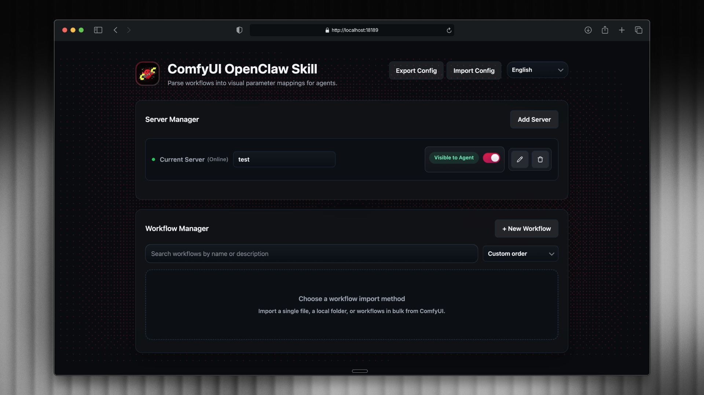

<div align="center">
  

  <h1>ComfyUI Skills for OpenClaw</h1>

  <p><strong>Agent-friendly ComfyUI workflow skills for OpenClaw, Codex, Claude Code, and other agents.</strong></p>

  <p>
    Use this project to turn ComfyUI workflows into callable skills with an agent-friendly CLI as the primary interface,
    plus a visual Web UI for easier configuration and testing.
  </p>

  <p>
    <a href="https://huangyuchuh.github.io/ComfyUI_Skills_OpenClaw/"></a>
    <a href="https://github.com/HuangYuChuh/ComfyUI_Skills_OpenClaw/blob/main/LICENSE"></a>
    <a href="https://github.com/HuangYuChuh/ComfyUI_Skills_OpenClaw/stargazers"></a>
    <a href="https://github.com/HuangYuChuh/ComfyUI_Skills_OpenClaw/network/members"></a>
    <a href="https://www.python.org/"></a>
  </p>

  <p>
    <a href="https://www.bilibili.com/video/BV1a6cUzVEE6/">🎬 Demo Video</a> ·
    <a href="https://huangyuchuh.github.io/ComfyUI_Skills_OpenClaw/">📘 Docs</a> ·
    <a href="#quick-start">🧭 Quick Start</a> ·
    <a href="#web-ui">🖥️ Web UI</a> ·
    <a href="#multi-server-management">🛰️ Multi-Server</a>
  </p>

  <p>
    <strong>English</strong> ·
    <a href="./README.zh.md">简体中文</a> ·
    <a href="./README.zh-TW.md">繁體中文</a> ·
    <a href="./README.ja.md">日本語</a>
  </p>
</div>

---

## Overview

ComfyUI Skills for OpenClaw is an agent-friendly bridge that turns ComfyUI workflows into callable skills for agents.

Instead of asking an agent to manipulate raw ComfyUI graphs, this project gives each workflow a clean, controlled interface through a CLI and schema-based parameter mapping. It works with OpenClaw, Codex, Claude Code, and other agents that can run shell commands.

Use it when you want to import existing ComfyUI workflows, expose only the parameters that matter, run them from chat or agent tasks, and manage everything through one consistent workflow layer.

| Best for | What you get |
|----------|--------------|
| OpenClaw, Codex, and Claude Code users | A ComfyUI workflow layer that agents can call safely |
| Existing ComfyUI workflow owners | A clean way to reuse exported workflows without exposing the full graph |
| Multi-machine setups | One namespace for local and remote ComfyUI servers |
| Users who want visual setup and testing | An optional Web UI for configuring, previewing, and validating workflows before agents use them |

## Why This Project

Working with ComfyUI directly is powerful, but not ideal for agent-driven execution.

Raw workflow graphs are noisy, fragile, and difficult for an agent to use safely. Direct API calls also require you to manually manage parameter injection, workflow naming, server selection, dependency checks, and output handling. This project adds a stable abstraction layer on top of ComfyUI so agents can discover workflows, call them with structured arguments, and get predictable results.

Compared with working directly against ComfyUI workflows or lower-level tooling, the CLI in this project is designed to be more agent-friendly: clearer inputs, safer parameter exposure, better workflow discovery, and more predictable execution results.

This makes the project useful when you want to:

- Turn an existing ComfyUI workflow into an agent tool
- Expose a safe parameter contract instead of the full graph
- Run workflows across multiple ComfyUI servers
- Reuse the same workflow setup across OpenClaw, Codex, Claude Code, and similar agents

## Features

| Capability | Why it matters |
|------------|----------------|
| **Agent-friendly CLI** | Designed for agents, not just humans. It provides a cleaner and more reliable interface than working directly with raw ComfyUI graphs or lower-level ComfyUI interaction patterns. |
| **Schema-based parameter mapping** | Expose only the fields you want the agent to control, with clear aliases, types, and descriptions. |
| **ComfyUI workflow import** | Import workflow JSON files, auto-detect formats, and generate the mapping layer needed for agent use. |
| **Multi-server routing** | Manage local and remote ComfyUI servers under one namespace and route jobs to the right machine. |
| **Dependency management** | Check missing nodes and models before execution and install supported dependencies through the CLI. |
| **Optional Web UI** | A visual layer for configuration and testing. It does not replace the CLI, and agent-facing actions still map to the same CLI workflow. |

<a id="quick-start"></a>
## Quick Start

Get ComfyUI Skills running in a few minutes.

Before you start, make sure you have:

- Python 3.10+
- A running ComfyUI server
- An exported workflow in ComfyUI API format if you want to test execution right away

### 1. Clone the project

Choose the directory that matches your agent environment.

<details>
<summary><strong>For OpenClaw</strong></summary>

```bash
cd ~/.openclaw/workspace/skills
git clone https://github.com/HuangYuChuh/ComfyUI_Skills_OpenClaw.git comfyui-skill-openclaw
cd comfyui-skill-openclaw
```

</details>

<details>
<summary><strong>For Claude Code</strong></summary>

```bash
cd ~/.claude/skills
git clone https://github.com/HuangYuChuh/ComfyUI_Skills_OpenClaw.git comfyui-skill
cd comfyui-skill
```

</details>

<details>
<summary><strong>For Codex</strong></summary>

```bash
cd ~/.codex/skills
git clone https://github.com/HuangYuChuh/ComfyUI_Skills_OpenClaw.git comfyui-skill
cd comfyui-skill
```

</details>

### 2. Create your local config

```bash
cp config.example.json config.json
```

### 3. Install the CLI

```bash
pipx install comfyui-skill-cli
```

Or:

```bash
pip install comfyui-skill-cli
```

If you already have the CLI installed, upgrade it with:

```bash
# If you installed it with pipx
pipx upgrade comfyui-skill-cli

# If you installed it with pip
python3 -m pip install -U comfyui-skill-cli
```

### 4. Verify the setup

```bash
comfyui-skill server status
comfyui-skill list
```

### 5. Import and run your first workflow

```bash
comfyui-skill workflow import /absolute/path/to/my-workflow.json
comfyui-skill deps check local/my-workflow
comfyui-skill run local/my-workflow --args '{"prompt": "a white cat"}'
```

For manual CLI imports, the recommended approach is to pass the workflow JSON as an absolute path. That avoids path ambiguity and keeps the storage model simple.

For example:

```bash
comfyui-skill workflow import /Users/yourname/Downloads/my-workflow.json
```

After import, the CLI stores the normalized workflow and schema under `data/<server_id>/<workflow_id>/`, for example `data/local/my-workflow/workflow.json` and `data/local/my-workflow/schema.json`.

This is also the formal layout used by the Web UI and by Agent/OpenClaw-driven imports:

```bash
data/<server_id>/<workflow_id>/
  workflow.json
  schema.json
  history/
```

At this point, the CLI will read your local `config.json`, discover available workflows, and execute them through your ComfyUI server.

If you prefer a visual setup and testing flow, see the [Web UI](#web-ui) section below.

## Setup Options

Choose the path that matches how you want to use the project.

### OpenClaw

Use this path if you want OpenClaw to discover and execute ComfyUI workflows as skills.

- Clone the repository into `~/.openclaw/workspace/skills`
- Install `comfyui-skill-cli`
- Configure `config.json`
- Import workflows and expose agent-safe parameters

### Codex or Claude Code

Use this path if you want coding agents to call ComfyUI workflows through shell commands.

- Clone the repository into your agent skills directory
- Install the CLI
- Verify with `comfyui-skill list`
- Execute workflows with structured `--args`

### Web UI

Use this path if you want a visual interface for configuration, inspection, and testing while keeping the CLI as the primary agent-facing interface.

```bash
./ui/run_ui.sh
```

The launch script automatically creates a project `.venv` if needed and installs the required UI dependencies into that virtual environment.

Then open:

```text
http://localhost:18189
```

### Manual Setup

Use this path if you want direct control over `config.json`, `workflow.json`, and `schema.json`.

<details>
<summary><strong>Expand for manual config file setup</strong></summary>

#### 1) Edit `config.json`

```jsonc
{
  "servers": [
    {
      "id": "local",
      "name": "Local",
      "url": "http://127.0.0.1:8188",
      "enabled": true,
      "output_dir": "./outputs"
    }
  ],
  "default_server": "local"
}
```

#### 2) Place workflow files

```text
data/local/my-workflow/
  workflow.json  # ComfyUI API-format export
  schema.json    # Parameter mapping
```

#### 3) Write `schema.json`

```jsonc
{
  "description": "My workflow",
  "enabled": true,
  "parameters": {
    "prompt": {
      "node_id": 10,
      "field": "prompt",
      "required": true,
      "type": "string",
      "description": "Prompt text"
    }
  }
}
```

</details>

## How It Works

The project adds a controlled execution layer between agents and ComfyUI workflows.

1. Export a workflow from ComfyUI in API format.
2. Import the workflow and define which parameters should be exposed.
3. Store that mapping in `schema.json`.
4. Call the workflow through `comfyui-skill` with structured arguments.
5. Submit the job to the target ComfyUI server and return generated outputs.

In practice, the flow looks like this:

```text
ComfyUI workflow.json
  -> schema.json parameter mapping
  -> comfyui-skill CLI
  -> ComfyUI server
  -> generated image outputs
```

This structure lets agents work with a stable contract instead of reasoning about raw ComfyUI graph nodes.

## Common Commands

Use these commands for the most common workflow operations.

### Discover workflows

```bash
comfyui-skill list
comfyui-skill info local/txt2img
```

### Run a workflow

```bash
comfyui-skill run local/txt2img --args '{"prompt": "a white cat"}'
```

### Submit a workflow asynchronously

```bash
comfyui-skill submit local/txt2img --args '{"prompt": "a white cat"}'
comfyui-skill status <prompt_id>
```

### Import a workflow

```bash
comfyui-skill workflow import /absolute/path/to/my-workflow.json --check-deps
```

For manual CLI imports, prefer an absolute path. After a successful import, the formal files live under `data/<server_id>/<workflow_id>/`.

### Check dependencies

```bash
comfyui-skill deps check local/my-workflow
comfyui-skill deps install local/my-workflow --all
```

### Manage servers

```bash
comfyui-skill server list
comfyui-skill server add --id remote --url http://10.0.0.1:8188
comfyui-skill server status
```

For the full CLI reference, see [ComfyUI Skill CLI](https://github.com/HuangYuChuh/ComfyUI_Skill_CLI).

## Workflow Requirements

To work reliably with this project, each workflow should meet these requirements.

- The workflow must be exported from ComfyUI in API format.
- The workflow should include an output node such as `Save Image`.
- The workflow needs a `schema.json` mapping so the agent can work with a clean parameter interface.
- The target ComfyUI server must have the required custom nodes and models installed.

If you use `comfyui-skill workflow import`, the CLI can help generate the required mapping and check dependencies before execution.

<a id="multi-server-management"></a>
## Multi-Server Management

This project is designed to work with more than one ComfyUI server.

You can keep multiple local or remote ComfyUI instances under one configuration and route workflows by namespace. This is useful when different machines serve different purposes, such as lightweight local testing, larger GPU jobs, or model-specific environments.

Examples:

```bash
comfyui-skill server add --id local --url http://127.0.0.1:8188
comfyui-skill server add --id remote-a100 --url http://10.0.0.20:8188
comfyui-skill server list
```

Workflows are addressed with the format:

```text
<server_id>/<workflow_id>
```

For example:

```text
local/txt2img
remote-a100/sdxl-base
```

Both servers and workflows support enable and disable switches, so agents only see workflows that are currently available.

You can also move settings between machines with:

```bash
comfyui-skill config export --output ./backup.json
comfyui-skill config import ./backup.json --dry-run
comfyui-skill config import ./backup.json
```

<a id="web-ui"></a>
## Web UI

A local web interface is available for visual configuration and testing. It is optional, and it exists to make setup, inspection, and validation easier. The skill itself is still designed for agents to use through the CLI.

### Launch

```bash
./ui/run_ui.sh                    # macOS/Linux
# or: ui\run_ui.bat               # Windows
```

The launch scripts create a project `.venv` when needed and install UI dependencies into that virtual environment. No global Web UI dependency install is required.

Visit `http://localhost:18189`.

### What you can do in the Web UI

- Upload workflows exported from ComfyUI
- Configure parameter mappings with a visual editor
- Manage multiple servers and workflows in one place
- Search, reorder, and inspect workflow definitions
- Test and validate workflow configuration before handing it off to agents
- Use the interface in English, Simplified Chinese, or Traditional Chinese

Everything the Web UI configures maps back to the same underlying CLI-driven workflow. It is a visual companion for setup and testing, not a separate execution model.

Frontend source lives in a [separate repository](https://github.com/HuangYuChuh/ComfyUI_Skills_OpenClaw-frontend).

## Common Issues

### HTTP 400 on `/prompt`

The workflow payload or one of the injected parameter values is invalid.

Check:

- Whether the workflow was exported in API format
- Whether the schema mapping points to the correct node and field
- Whether the provided argument types match the schema

### No images returned

The workflow may be missing a valid output node such as `Save Image`.

### Connection failed

Check that:

- The ComfyUI server is running
- The server URL in `config.json` is correct
- The selected server is enabled

### Missing nodes or models

Run:

```bash
comfyui-skill deps check <workflow_id>
```

Then install supported dependencies if needed.

## Changelog

Recent highlights:

- **v0.3.1**: Added ComfyUI API Key support for cloud API nodes such as Kling, Sora, and Nano Banana.
- **v0.3.0**: Added dependency check and install, non-blocking `submit` and `status`, image upload, import preview, and execution history.
- **v0.2.0**: Moved frontend source code into a separate repository and added automated frontend sync support.

See [CHANGELOG.md](./CHANGELOG.md) for the full release history.

## Resources

- [English README](./README.md)
- [简体中文 README](./README.zh.md)
- [繁體中文 README](./README.zh-TW.md)
- [日本語 README](./README.ja.md)
- [ComfyUI Skill CLI](https://github.com/HuangYuChuh/ComfyUI_Skill_CLI)
- [Frontend Repository](https://github.com/HuangYuChuh/ComfyUI_Skills_OpenClaw-frontend)
